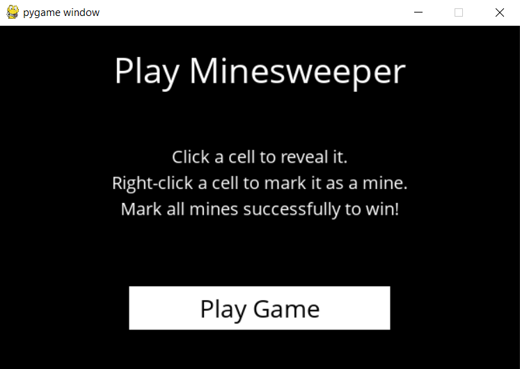
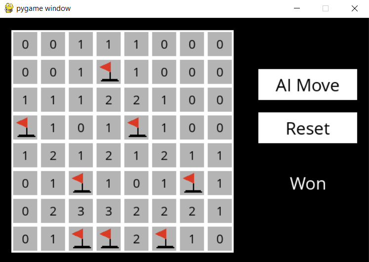
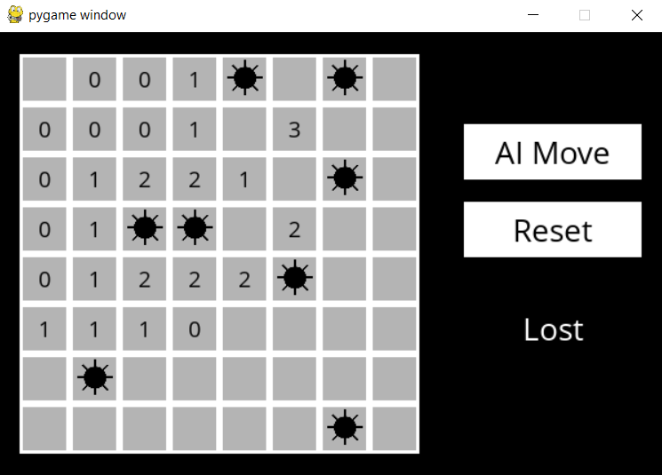

# Minesweeper AI

Minesweeper is a puzzle game that consists of a grid of cells, where some of the cells contain hidden “mines.” 

Clicking on a cell that contains a mine detonates the mine, and causes the user to lose the game. Clicking on a “safe” cell (i.e., a cell that does not contain a mine) reveals a number that indicates how many neighboring cells – where a neighbor is a cell that is one square to the left, right, up, down, or diagonal from the given cell – contain a mine.

The goal of the game is to flag (i.e., identify) each of the mines.

## Project Overview

The project is organized into two main files:

- **minesweeper.py:** This module contains the core logic for the Minesweeper game, including the representation of the game board, logical sentence modeling, and the MinesweeperAI class that handles strategic moves.

- **runner.py:** This script provides a graphical interface for playing Minesweeper. It allows you to interact with the Minesweeper game, either making moves yourself or letting the AI play for you.

## Implementation Details

### Minesweeper Class

- Represents the Minesweeper game board.
- Handles game initialization, mine placement, and checking for game-winning conditions.
- Provides methods for printing the game state.

### Sentence Class

- Represents logical sentences about the Minesweeper game.
- Contains functions for identifying known mines and known safe cells.
- Updates itself when new information about cells is provided.

### MinesweeperAI Class

- Implements the Minesweeper game player with an intelligent AI.
- Tracks moves made, known safe cells, known mines, and a knowledge base of logical sentences.
- Utilizes the knowledge base to make informed moves.

## Screenshots

  
  
  &nbsp; &nbsp; &nbsp; &nbsp;
  

## How to Play

1. Run `python runner.py` to start the Minesweeper game.
2. Choose to make moves yourself or let the AI play.
3. Make strategic moves based on known safe cells and mines.

Enjoy playing Minesweeper with the intelligent AI!

------------

This repo is part of Harvard's CS50 AI studies.
